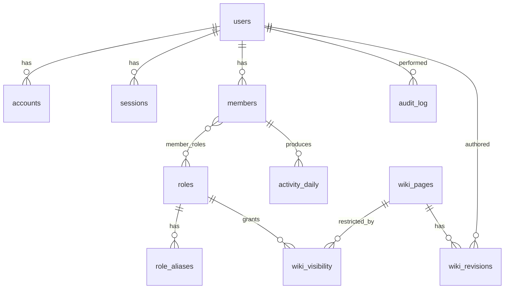

# 妖・和風神話コンセプトWebサイト 引き継ぎ資料 (v3)

v2 からの主な変更点：
- §1.1 の方針を「**Botは後付け前提、Web単独で完結するMVPを作る**」に確定
- §5「データモデル」を新設（全テーブルをMVP前に確定）
- §6「ディレクトリ構成・コード規約」を新設（リポジトリ層を導入）
- §7「ログイン画面 素材調達計画」を新設
- §10「認証フロー詳細」を新設、scope に `guilds.members.read` を追加
- §11「ロール権限モデル」を新設（alias マッピング）
- §15「セキュリティ」§16「観測性」§18「コスト試算」を新設
- §20 マイルストーンを M0a/b/c, M1a/b/c, M3a/b/c に細分化
- §21 未決定事項に「MVP前/M6以降」の仕分けを追加

---

## 1. プロジェクト概要

- **対象サーバー**: Discordサーバー
- **規模感**:
  - 書き込み・編集ユーザー（運営・幹部）: 約30名
  - 閲覧ユーザー（マイページ・Wiki）: 200〜500名
  - Bot監視対象: 全メンバー
- **目的**: Discord活動データの可視化 + 「妖の会社」としての世界観表現
- **コンセプト**: 和風神話・妖（あやかし）、黄泉平坂
- **副次目的**: 開発者自身のThree.js・WebGL技術習得

### 1.1 開発方針（v3で確定、ログイン画面方針 v3.1 で補強）

**まず Web を MVP まで作りきり、Bot は後から足す。** Bot を足したときに既存コードへ破壊的変更が入らない構造を最初から取る。具体的には次の3点を遵守：

1. ロール・入鯖日は OAuth API（`guilds.members.read`）で取得する。Bot 不在でも本人なら自分の情報が取れる
2. データ源を切り替え可能なリポジトリ層を1枚噛ませる（§6）
3. Bot 用テーブル（`activity_daily`, `notifications`）も MVP 段階で空のまま作っておく（§5）

**ログイン画面は原神ランチャー的な没入演出を MVP から目指す**ため、以下を追加で確定：

4. **Three.js は MVP から導入**する（v2 待ちにしない）。シーンの3D表現はログイン画面の主役
5. **具象イラストは不採用**。プロシージャル中心 + 抽象テクスチャのみで構築する。安っぽく仕上がった場合は純プロシージャル（Active Theory 系コードアート）に振り切る退避路を用意
6. **BGM + 環境音 + SFX を実装**する。ただし自動再生はしない、初回はミュート起動 + ユーザー操作で起動、設定は localStorage で保持

詳細は別資料『ログイン画面詳細設計 v1』を参照。

---

## 2. 構成方針

### 基本方針
- **Web=エッジ、Bot=常駐、DB=共有**の三層分離
- **Bot無くなる可能性も視野**、Bot依存機能と非依存機能を明確に分離
- **MVP最短**を優先、演出・運営機能は後段
- 30人規模の過剰設計を避け、500人閲覧に耐えるキャッシュ戦略を入れる

### Bot有無による機能分担

| 機能 | Bot有り時 | Bot無し時（MVP既定） |
|------|----------|---------------------|
| ロール表示 | BotがDB更新 | OAuth API + TTLキャッシュ |
| 入鯖日表示 | BotがDB更新 | OAuth API + TTLキャッシュ |
| 活動量グラフ | Botが日次集計 | UI上は「準備中」表示 |
| Web→Discord通知 | DB通知キュー経由 | DBに溜まるが配信されない（後で配信開始） |
| 閲覧制限 | DB読み取り | DB読み取り（同じ） |

→ **MVPはBot無しで完全に成立する**。Bot は追加機能のレイヤーとして実装。

---

## 3. 技術スタック

| 役割 | 技術 | 備考 |
|------|------|------|
| Webフレームワーク | Astro (SSR) + `@astrojs/cloudflare` | Cloudflare Pages にデプロイ |
| 認証 | Auth.js (Discord provider) | edge対応のため `@auth/core` 直接利用 |
| ORM | Drizzle | Cloudflare Workers環境との相性、軽量 |
| DB | Neon (Serverless Postgres) | CF Workers からも VPS Bot からも接続可能 |
| ホスティング (Web) | Cloudflare Pages | 無料枠で500人規模に十分 |
| ホスティング (Bot) | VPS（自宅 or 借用） | discord.js 常駐、systemd 管理 |
| アニメーション | GSAP + ScrollTrigger | UI演出・テキスト・遷移 |
| 3D描画 | Three.js + postprocessing | **MVPから導入**、ログイン画面の主役 |
| 音再生 | Howler.js | BGM・環境音・SFX、cross-browser対応 |
| Botフレームワーク | discord.js (TypeScript) | 自前で新規作成 |
| パッケージ管理 | pnpm workspace | Web/Bot で schema 共有のためモノレポ |
| テスト | MVPでは導入しない | 後で Vitest を入れる前提だけ残す |
| CSS | Tailwind CSS + Astro scoped CSS | 演出系は scoped、汎用は Tailwind |
| 言語 | 日本語固定 | i18n は導入しない |
| ブラウザサポート | モダンEvergreen のみ | IE/旧Safari は非対応 |

### 採用しなかったもの・理由
- **Hono別建てAPI**: Astro API routes で十分、二重構成のメリット無し
- **VPS全部同居**: Web の500人スケールに対しスケールアウトしにくい
- **Supabase**: 認証機能が重複（Auth.js使うため）、Neonのほうが CF Workers 相性良い
- **Redis**: 規模的に不要、Postgres で通知キュー・セッション管理可能
- **Sharp 等の画像処理ランタイム**: CF Workers で動かないため、ビルド時処理 or Cloudflare Images

---

## 4. アーキテクチャ図

```
┌─────────────────────────┐    ┌────────────────────┐
│ Cloudflare Pages        │    │ VPS (Bot後付け時)    │
│ ┌─────────────────────┐ │    │ ┌────────────────┐ │
│ │ Astro SSR           │ │    │ │ Discord Bot    │ │
│ │ + Auth.js           │ │    │ │ (discord.js)   │ │
│ │ + Drizzle           │ │    │ │ systemd常駐     │ │
│ │ + Repository層       │ │    │ └────────┬───────┘ │
│ └─────────┬───────────┘ │    └──────────┼─────────┘
└───────────┼─────────────┘               │
            │                              │
            └──────────┬───────────────────┘
                       ▼
            ┌──────────────────┐
            │ Neon Postgres    │
            │ (共有DB)          │
            └──────────────────┘
```

- Web⇄Bot は**直接通信せず、DB経由で疎結合**
- Bot が落ちていても Web は動く（古いデータが見える）
- Web が落ちていても Bot は計測継続
- **Bot を廃止する場合は VPS 層を丸ごと削除**するだけ

---

## 5. データモデル（MVP前に確定）

Bot 後付けを破綻させないため、Bot 用テーブルも最初から作る。

### ER（Mermaid）



### テーブル一覧

| テーブル | 主な用途 | Bot 必要か |
|---------|---------|----------|
| `users` | Auth.js 標準（id, name, email, image） | 不要 |
| `accounts` | Auth.js 標準（OAuth tokens 含む） | 不要 |
| `sessions` | Auth.js 標準 | 不要 |
| `verification_tokens` | Auth.js 標準 | 不要 |
| `members` | Discord guild member 情報（user_id, joined_at, nickname, last_role_sync_at, bio） | 不要（OAuth で初期化） |
| `roles` | Discord ロールのキャッシュ（discord_role_id, name, color, sort_order） | 不要（個人ログイン時に upsert） |
| `member_roles` | members ↔ roles 中間 | 不要 |
| `role_aliases` | アプリ内 alias → role_id（'admin', 'editor' など） | 不要（管理画面で設定） |
| `wiki_pages` | Wiki ページのメタ（slug, title, current_revision_id） | 不要 |
| `wiki_revisions` | Wiki 履歴（page_id, content, author_id, created_at） | 不要 |
| `wiki_visibility` | ページの閲覧制限（page_id, required_role_alias） | 不要 |
| `activity_daily` | 日次集計（user_id, date, message_count, reaction_count） | **Bot必須**（MVPは空） |
| `notifications` | Web→Discord 通知キュー（payload, status, created_at, sent_at） | **Bot必須**（MVPは空） |
| `audit_log` | 重要操作の監査（user_id, action, target, at） | 不要 |

### 注記
- `accounts.access_token` `accounts.refresh_token` は **暗号化して保存**（Auth.js の adapter で raw 保存される場合は app-level encryption を追加検討）
- `wiki_revisions` は immutable、現在版は `wiki_pages.current_revision_id` で参照
- 楽観ロック：保存時に `WHERE current_revision_id = :clientRevId` を付けて 0 件なら衝突扱い

---

## 6. ディレクトリ構成・コード規約

### モノレポ構成（pnpm workspace）

```
/
├ apps/
│  ├ web/                  Astro + Auth.js
│  └ bot/                  discord.js (Bot後付け時に作る)
├ packages/
│  ├ db/                   Drizzle schema・migration（Web/Bot で共有）
│  └ shared/               型定義・ユーティリティ
└ pnpm-workspace.yaml
```

### Web 内部構成

```
apps/web/src/
├ pages/                   Astro ページ
├ components/              UI コンポーネント
├ layouts/
├ lib/
│  ├ repos/                ★ データ源切り替えの境界
│  │  ├ membership.ts
│  │  ├ activity.ts
│  │  ├ wiki.ts
│  │  └ notifications.ts
│  ├ auth/                 Auth.js 設定
│  ├ discord/              Discord API クライアント
│  └ cache/                TTL キャッシュ実装
├ styles/
└ assets/                  画像・SVG・フォント
```

### リポジトリ層の規約（重要）

UI からは **必ず repos/ 越しにアクセス**する。直接 Discord API も DB も叩かない。

```ts
// lib/repos/membership.ts
export interface MembershipRepo {
  getMembership(userId: string): Promise<Membership>;
  refreshFromDiscord(userId: string): Promise<void>;
}

// MVP実装（OAuth API + TTLキャッシュ）
export const membershipRepo: MembershipRepo = {
  async getMembership(userId) { /* OAuth叩く + キャッシュ */ },
  async refreshFromDiscord(userId) { /* キャッシュ無効化 + 再取得 */ },
};

// Bot後付け時は同じインターフェースで DB から読む実装に差し替え
```

`activity` と `notifications` も同様。MVP では `activity.getDaily()` は `null` を返し、UI 側で「準備中」表示にする。

---

## 7. サイト構造

```
ログイン画面
  └→ ハブ（ポータル画面）
        ├→ マイページ
        ├→ 公開Wiki（ロール別閲覧制限あり）
        └→ 運営ダッシュボード（幹部限定）
```

### MVP に含めるページ

| ページ | MVPで作る内容 | v2以降 |
|--------|--------------|--------|
| ログイン | GSAP演出 + OAuth | Three.jsワープ |
| ハブ | 襖2〜3枚の選択画面 | カーソル追従の精緻化 |
| マイページ | ロール・入鯖日・自己紹介編集・設定 | 活動量グラフ（Bot必須） |
| Wiki | 表示・Web編集・ロール制限 | 履歴・差分UI |
| 運営ダッシュボード | ガワのみ（中身は「準備中」） | 議事録・タスク管理など |
| エラー / 404 | 世界観に合った最小演出（必須） | 凝った演出 |

### ハブのレイアウト方針

- **選択画面型（A案）**: 3枚の襖を並べて行き先を選ばせる
- 一般メンバー: 襖2枚（マイページ・Wiki）
- 幹部: 襖3枚（＋運営ダッシュボード）
- カーソル追従でリアルタイムに奥行き・光が変化するインタラクション
- **タッチ環境**（`(hover: none)` または `(pointer: coarse)`）ではタップで選択、追従なし

---

## 8. ログイン画面 設計仕様

### キーワード
彼岸花・鳥居・黄泉平坂・霧・幽世

### カラーパレット

| 要素 | カラー・方向性 |
|------|--------------|
| ベース | 深い黒（#0a0509） |
| 霧・炎 | 青白（冷たい光） |
| 彼岸花 | 深紅 |
| 鳥居 | 暗い朱色 |
| テキスト・縁 | くすんだ金 |

### レイヤー構成（奥→手前）

```
Layer 1 / 奥    : 青白い幽世の光（霧を通して滲む）
Layer 2 / 鳥居列 : 朱色、坂を下る配置（黄泉平坂）
Layer 3 / 霧    : 中層、足元と奥を拡散
Layer 4 / 彼岸花 : 手前、ボケあり
Layer 5 / UI    : サーバー名 + 御札ボタン
```

### UI仕様
- **フォント**: Yuji Syuku（Google Fonts、`font-display: swap`）
- **サーバー名**: 中央配置、筆文字系
- **御札ボタン**: サーバー名直下、縦長短冊型、縦書き「参拝」
- **ホバー演出**: 青白い炎がちらつく、御札が軋むように揺れる
- **idle animation**: 御札がわずかに揺れ続ける

### ログインフロー（演出面）

```
① ページ到達 → サーバー名がじわっと浮かび上がる
② 御札ホバー → 炎ちらつき + 御札の揺れ
③ 御札クリック → Discord OAuth認証へ
④ 認証完了 → ハブへ遷移（ワープ演出はv2）
```

### Three.js 実装方針（v2向けメモ）
- 待機中のパララックスは GSAP で実装
- 認証完了後に Three.js の canvas をオーバーレイ起動
- 切り替えのつなぎ目はホワイトフラッシュで隠す
- 鳥居はローポリ + InstancedMesh で軽量化
- 霧は Three.js の Fog パラメータで奥を隠す
- 初回のみフルアニメーション、2回目以降は短縮版（localStorage 管理）
- **「飛ばす」明示UIを併設**（端末変更時の救済）

---

## 9. ログイン画面 素材調達計画（新設）

### 素材の作り方（MVP想定）

1. **AI画像生成**（Midjourney / Stable Diffusion 等）でレイヤーごとのモチーフを生成
   - 鳥居列、彼岸花、霧、幽世の光をそれぞれ別画像で作る
2. **手作業で背景透過 + レイヤー分離**（Photoshop ジェネレーティブ塗りつぶし or remove.bg）
3. **書き出し**：各レイヤー WebP + AVIF、解像度 2 系統（mobile 750w / desktop 1920w）
4. **配置**：CSS で重ねて GSAP でパララックス
5. **ライセンス記録**：使用した生成サービス・プロンプト・改変履歴をリポジトリに残す

### ファイル配置

```
apps/web/src/assets/login/
├ layer1-yomi.webp (+.avif, 2x)
├ layer2-torii.webp
├ layer3-mist.webp
├ layer4-higanbana.webp
└ ofuda.svg            御札はSVGで作る（拡縮・色変更が楽）
```

### 代替案
- 発注：イラストレーターに依頼（質は最高、コストと納期がかかる）
- フリー素材合成：質感のばらつきが出やすい
- SVG手描き：軽量だが幽玄な質感は出にくい

→ **MVP は AI 生成 + 手作業分離**を採用。v2 で発注に差し替えも可能。

---

## 10. 認証フロー詳細（新設）

### OAuth scope

```
identify email guilds.members.read
```

`guilds.members.read` を入れることで `GET /users/@me/guilds/{GUILD_ID}/member` が叩け、**Bot が居なくても本人のロールと入鯖日が取れる**。これが MVP の柱。

### 初回ログイン

```
1. /login で「参拝」クリック
2. Discord OAuth 同意画面 → 認可コードがコールバック URL に届く
3. Auth.js が code → access_token + refresh_token を交換
4. accounts テーブルに保存（暗号化）
5. /users/@me/guilds/{GUILD_ID}/member を叩いて roles, joined_at, nickname を取得
6. members テーブルに upsert、member_roles も再構築
7. session 発行 → ハブへリダイレクト
```

### 2回目以降

- session cookie が有効ならそのまま入室
- session 期限切れ → 再ログインフロー
- access_token 期限切れの API 呼び出し → refresh_token で延長 → 失敗したら強制ログアウト

### ロール再同期トリガー（Bot無し時）

- TTL: 幹部 15 分、一般 1 時間
- 強制再同期：運営ダッシュボード入室時、マイページの「お祓い」ボタン押下時

### Cookie 設定

```
HttpOnly; Secure; SameSite=Lax; __Host- prefix
```

### refresh 失敗時の UX

- 強制ログアウト → ログイン画面に「お祓いが切れました」演出を1度だけ表示
- localStorage フラグで多重表示を防ぐ

### ログアウト
- `sessions` 行を削除
- Discord token の revoke は任意（やらなくても害は少ない）

---

## 11. ロール権限モデル（新設）

### Discord ロール → アプリ alias マッピング

`role_aliases` テーブルで管理：

```
alias='admin'  → discord_role_id='1234...'  (幹部)
alias='editor' → discord_role_id='5678...'  (編集権あり)
alias='member' → 既定（未指定なら全員 member 扱い）
```

### コード側

```ts
hasRole(user, 'admin')   // alias で判定
hasAnyRole(user, ['admin', 'editor'])
```

→ Discord 側でロール作り直しがあっても DB の `role_aliases` だけ書き換えれば吸収できる。**コード内に discord_role_id をハードコードしない**。

### 視覚的区別（未確定）
- ロールごとに色・アイコン・称号を `roles` テーブルに付与
- マイページのロール表示で和風アレンジ（札・印・紋など）

---

## 12. Bot 連携（後付け時の仕様）

### Bot でやること

1. ロール変更のリアルタイム反映（`guildMemberUpdate`）
2. 活動量計測（メッセージ数・反応数の日次集計）
3. Web→Discord への通知送信（`notifications` の poll → 送信 → status 更新）

### 設計のポイント
- **Web⇄Bot 直接通信なし**、すべて DB 経由
- 通知は `notifications` テーブルの**キュー方式**（Bot 側が polling）
- 活動量はメモリバッファ → 一定間隔で DB flush（毎メッセージ DB 書きしない）
- 個別メッセージは保存せず**日次集計のみ**保持
- Bot 起動時の全メンバー初回同期はチャンク処理

### intents
- `GUILDS`、`GUILD_MEMBERS`（特権）、`GUILD_MESSAGES`、`MESSAGE_CONTENT`（特権）
- 100 サーバー未満は自己申告で特権 intent 取得可能

### VPS 運用
- **スペック目安**: 2〜4GB RAM
- systemd または pm2 でプロセス管理、自動再起動必須
- 簡易ヘルスチェック HTTP エンドポイント（`/health`）を立てて UptimeRobot で監視
- ログは journald or ファイル
- バックアップは Neon 側

### Bot を廃止する場合の影響
- マイページの活動量グラフが消える
- Web→Discord 通知機能が消える
- ロールは OAuth 経由 + TTL キャッシュ運用に切り替え（既に MVP がそれ）
- VPS コストが消える

---

## 13. データ・キャッシュ戦略

### セッション
- DB で管理（`sessions` テーブル）
- 有効期限 1〜2 週間、Discord access_token の 7 日に揃える
- refresh_token で裏で延長

### ロール情報
- **Bot 有り時**: Bot が DB を最新化、Web は読むだけ
- **Bot 無し時**: ログイン時取得 + TTL キャッシュ（幹部 15 分・一般 1 時間）
- 強制再取得トリガー: 運営ダッシュボード入室時、手動「お祓い」ボタン

### Wiki
- ロール別閲覧制限のため CDN キャッシュ不可
- アプリ内メモリキャッシュ程度で十分
- 編集時にキャッシュ無効化
- 楽観ロック（revision_id チェック）あり
- `wiki_pages` と `wiki_revisions` を分けて履歴を保持

### 活動量（Bot 有り時のみ）
- `activity_daily` テーブル: 日次集計
- 個人の値は自分の行だけ取るので軽量
- ランキング系は日次バッチでキャッシュ

### DB 接続
- CF Workers 側は Neon の `@neondatabase/serverless` adapter
- VPS Bot 側は `pg` パッケージ
- Neon の Pooled 接続文字列を使う

---

## 14. アクセシビリティ・スケール対応

200〜500人がアクセスする以上、演出は必ず以下を満たす：

- `prefers-reduced-motion: reduce` の挙動を**具体化**：
  - パララックス停止
  - 御札の揺れ停止（1回のフェードのみ）
  - カーソル追従無効
- 低スペック検出：`navigator.hardwareConcurrency < 4` または `navigator.deviceMemory < 4` で簡易モード
- ユーザー設定で「演出をオフ」を localStorage に保存（マイページ設定欄）
- LCP・CLS の計測（Cloudflare Web Analytics）
- WCAG 2.1 AA 準拠（コントラスト・フォーカスリング・キーボード操作）

---

## 15. セキュリティ（新設）

- **XSS**：Wiki 編集の出力は `rehype-sanitize`（Markdown）または DOMPurify（Tiptap）で必ず通す
- **iframe 埋め込み**：allowlist 制（Notion 埋め込みなど用途を限定）
- **CSRF**：Auth.js の標準対策に乗る、フォームには csrf token
- **SQL Injection**：Drizzle のプリペアドのみ使用、生 SQL に変数埋め込みしない
- **アクセストークン**：DB に保存する場合は app-level 暗号化（鍵は環境変数で管理）
- **権限改ざん防止**：ロール書き込みは Bot or サーバー側 OAuth fetch のみ。クライアントからの role 変更 API は作らない
- **`noindex`**：ログイン以外のページは `<meta name="robots" content="noindex,nofollow">` + `robots.txt` で `/me`, `/wiki/*`, `/admin/*` を Disallow
- **退会フロー**：マイページに「データ削除」ボタン。論理削除 or 物理削除のポリシーを決める（推奨：30日後に物理削除する論理削除）

---

## 16. 観測性（新設）

| 項目 | ツール | 備考 |
|-----|-------|------|
| エラー追跡 | Sentry (CF Workers integration) | Free 枠 |
| アクセスログ | Cloudflare Workers Logs / Logpush | 既定で取得 |
| Web Vitals | Cloudflare Web Analytics | LCP/CLS/INP |
| アップタイム | UptimeRobot | `/api/health` を 5 分間隔で ping |
| Bot 健康 | UptimeRobot | Bot の `/health` を ping（後付け時） |
| 監査ログ | `audit_log` テーブル | ロール変更・Wiki編集・運営操作 |

---

## 17. デプロイ・環境管理

- **Web**: GitHub → Cloudflare Pages 連携、push 自動デプロイ
- **Bot**: GitHub Actions 経由で SSH → VPS 配布、systemd reload
- **DB マイグレーション**: Drizzle Kit、CI で自動実行、Neon の branch 機能で本番/開発分離

### 環境分離

| 環境 | DB | Auth secret | Discord App |
|-----|-----|-------------|-------------|
| dev (local) | Neon dev branch | dev用 | dev用Application |
| preview (PR) | Neon ephemeral branch | preview用 | dev用Application |
| production | Neon main | production用 | 本番Application |

### 環境変数（3拠点共有）

- `DATABASE_URL`（Neon の Pooled 接続文字列）
- `DISCORD_CLIENT_ID` / `DISCORD_CLIENT_SECRET`
- `DISCORD_BOT_TOKEN`（Bot のみ、後付け時）
- `GUILD_ID`
- `AUTH_SECRET`
- `TOKEN_ENCRYPTION_KEY`（access_token 暗号化用）

シークレットマネージャ（1Password 等）の利用を推奨。

---

## 18. コスト試算（新設、2026年想定 / USD）

| 項目 | 想定プラン | 月額 |
|-----|-----------|------|
| Cloudflare Pages/Workers | Free または Workers Paid | $0〜5 |
| Neon Postgres | Free（0.5GB）または Launch | $0〜19 |
| ドメイン | `.com` / `.jp` | ~$1 |
| Sentry / 監視 | Free | $0 |
| VPS（Bot 採用時） | さくらVPS 1GB / Vultr 等 | $5〜10 |
| **小計（Bot 無し）** | | **$1〜25** |
| **小計（Bot 有り）** | | **$6〜35** |

500 人規模なら Free 枠で収まる可能性が高い。Auth.js のセッション/account 行が増えて Neon Free（0.5GB）を超えないかは要監視。

---

## 19. 個人情報・データ管理

- DB に保存するもの：Discord user_id, email, ロール, 自己紹介, 最終ログイン, 日次活動量
- 退会時の削除フローを MVP に入れる
- BAN ユーザーの扱い：ログイン拒否 + audit 目的で論理削除
- `audit_log` の保持期間：1 年（その後物理削除）

---

## 20. マイルストーン

| ID | 内容 | Bot 依存 |
|----|------|--------|
| M0a | モノレポ雛形（pnpm workspace, Astro app, db package） | 無 |
| M0b | Drizzle schema 全テーブル定義 + 初回 migration | 無 |
| M0c | Cloudflare Pages デプロイ（Hello だけ） | 無 |
| M1a | Auth.js + Discord OAuth、scope に `guilds.members.read` を含む | 無 |
| M1b | `/me` で自分の roles, joined_at が表示できる | 無 |
| M1c | リポジトリ層を導入し、UI 層がリポジトリ越しに動作 | 無 |
| M2 | マイページ完成（自己紹介編集 + ロール表示 + 入鯖日 + 設定） | 無 |
| M3a | Wiki スキーマ + 表示 | 無 |
| M3b | ロール別閲覧制限 | 無 |
| M3c | Web 編集 + revisions + 楽観ロック + サニタイズ | 無 |
| M4a | Three.js シーン雛形（カメラ・月・霧・鳥居 instancing） | 無 |
| M4b | シェーダー・パーティクル（狐火・粒子・bloom） | 無 |
| M4c | UI 重ね合わせ（御札・サーバー名・スキップ・音量トグル） | 無 |
| M4d | 音設計（Howler セットアップ・BGM・環境音・SFX） | 無 |
| M4e | 演出タイミング調整 + reduced-motion + 低スペック検出 | 無 |
| M4 判定 | 「安っぽくないか」判定、必要なら option 1 へ切り替え | 無 |
| M5 | 運営ダッシュボードのガワ + ハブ襖 UI + エラー/404 演出 | 無 |
| **— ここまでで MVP 完成 —** | | |
| M6 | Bot 雛形・ロール sync（Bot 採用時） | 有 |
| M7 | 活動量計測・マイページグラフ表示 | 有 |
| M8 | 通知キュー（Web→Bot→Discord） | 有 |
| M9 | ログイン→ハブのシネマティック遷移精緻化 | 無 |
| M10 | 運営ダッシュボードの中身追加 | - |

**M5 まで完了で「Bot なしでも遊べる完成形」**。Bot 要否は M6 開始時に再判断可能。

---

## 21. 未決定・保留事項（優先度づけ）

### MVP 着手前に決める

| 項目 | 状況 |
|------|------|
| 役職ロールの alias と視覚区別 | UI デザイン段階で確定 |
| Wiki 編集 UI（Markdown / Tiptap） | M3c 着手前に決定（推奨：Markdown + rehype-sanitize でスタート） |
| エラー/404 ページの簡易演出案 | M5 で実装するため案だけ用意 |
| 黄泉平坂と参拝モチーフの神道整合 | 世界観統一の観点で要確認 |
| 素材調達手段（AI 生成 / 発注 / SVG） | M4 着手前に確定 |

### M6 以降で決めればよい

| 項目 | |
|------|---|
| Bot 採用の最終判断 | M6 開始時 |
| 運営ダッシュボードの具体機能 | 議事録は Notion 埋め込みで暫定 |
| 活動量データの保持期間 | 永続 or 1 年で集計 |
| VPS スペックの確定 | Bot 採用決定後 |

---

## 22. 設計の決定事項・注意点

- **Astro は Cloudflare Pages 前提の SSR 構成**（Node API 使用箇所に注意、`Web Crypto` に置き換え）
- **Three.js はログイン遷移のみ**に限定して軽量化を維持、MVP 段階では実装しない
- **自前エンジン開発はしない**（Active Theory / Hydra は参考にとどめる）
- **`prefers-reduced-motion` 対応は必須**、スマホ低スペック端末向け簡易版も用意
- **Bot 無くなる可能性を常に意識**し、Bot 依存機能はリポジトリ層で分離して実装
- **Web⇄Bot の直接通信禁止**、必ず DB 経由
- **画像処理は Cloudflare Images またはビルド時処理**（Sharp 等は CF で動かない）
- **議事録などの機能は初期は Notion 埋め込みなど外部ツールで代替**
- **Active Theory を参考にしつつ、「常にカーソルに呼応している」UI を目指す**
- **コード内に discord_role_id をハードコードしない**（alias マッピング経由）
- **UI から DB / Discord API を直接叩かない**（必ず repos/ 越し）

---

## 23. 次のアクション

1. この資料 v3 をレビュー → 必要なら追記して fix
2. M0a 着手：pnpm workspace の雛形を作る
3. M0b 着手：Drizzle schema 定義
4. M4 の素材調達を並行で進める（AI 生成のプロンプト作りから）

